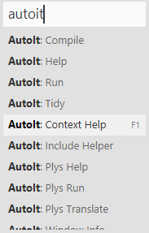
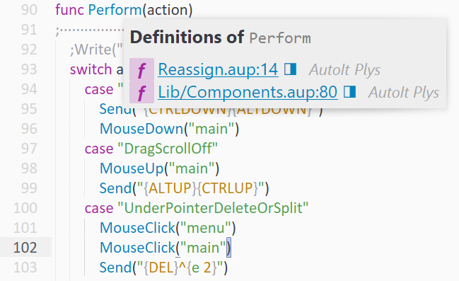

# AutoIt Plys package for Sublime Text
More powerful [AutoIt language](https://www.autoitscript.com/site/autoit/) and [Plys dialect](https://www.autoitscript.com/forum/topic/198342-plys-%E2%80%93-autoit-superset-with-namespaces-and-stuff/) package for [Sublime Text](https://www.sublimetext.com/) including better syntax highlighting, auto-completions, build systems for run and compile, *context help*, *“goto” feature*, comments toggling, Tidy and Include Helper command.

## Requirements
* [AutoIt](https://www.autoitscript.com/site/autoit/downloads/) (minimum)
* [Tidy or AutoIt Script Editor full set](https://www.autoitscript.com/site/autoit-script-editor/downloads/) for Tidy feature (optional)
* [AutoIt Plys translator](https://github.com/NSUSpray/Plys) for Plys language multiset features (optional)

## Installation
* Package control method (with autoupdate):
	1. open Sublime Text
	1. go to Command Palette (<kbd>Ctrl+Shift+P</kbd> on Windows/Linux, <kbd>⇧⌘P</kbd> on macOS) and enter “Install Package”
	1. type “AutoIt Plys”, select appropriate item and press Enter
* Manual method (without autoupdate):
	1. clone [repository](https://github.com/NSUSpray/AutoItPlysSublime) or [download ZIP with source files](https://github.com/NSUSpray/AutoItPlysSublime/archive/refs/heads/master.zip)
	1. extract package folder to the Sublime packages folder `Main menu > Preferences > Browse Packages…`
	1. rename folder to “AutoIt Plys”

## Features

**On Windows:** if you have the default Sublime Text keybindings intact, then you can

* *run*/*compile*/*translate* the current file (with AutoIt3.exe, Aut2Exe.exe or plys.aup.au3) via <kbd>Ctrl+B</kbd>
* *change the build mode* (between run/compile/translate) via <kbd>Ctrl+Shift+B</kbd>
* take you to AutoIt Help for word under cursor (*context help*) via <kbd>F1</kbd> **`NEW`**

Also some features are available from the main menu `Tools > AutoIt Plys`, including via mnemonics:

* invoke *Include Helper* on the current file <kbd>Alt</kbd><kbd>T</kbd><kbd>I</kbd><kbd>I</kbd>
* invoke *AutoIt Window Info* <kbd>Alt</kbd><kbd>T</kbd><kbd>I</kbd><kbd>F</kbd>
* invoke *AutoIt Help* <kbd>Alt</kbd><kbd>T</kbd><kbd>I</kbd><kbd>H</kbd>
* invoke *Plys Help* <kbd>Alt</kbd><kbd>T</kbd><kbd>I</kbd><kbd>P</kbd> **`NEW`**
* invoke *Tidy* on the current file (if it’s installed) via <kbd>Alt</kbd><kbd>T</kbd><kbd>I</kbd><kbd>T</kbd>

**On any platform** you can

* go to definition of the function by its name under cursor via <kbd>F12</kbd> **`NEW`**
* show list of the all functions in current file via <kbd>Ctrl+R</kbd> on Windows/Linux, <kbd>⌘R</kbd> on macOS **`NEW`**

## Advanced Configuration
For the build systems and Tidy command, if you have a non-default installation you will need to set your specific path to AutoIt3.exe, Aut2Exe.exe, and Tidy.exe in a file named AutoIt.sublime-settings in your User folder. You can access the settings file from Menu `Preferences > Package Settings > AutoIt Plys > Settings`. You should make a copy of left side panel at right side panel.

## Credits
* Syntax rules: [http://sublime-text-community-packages.googlecode.com/svn/pages/AutoIt.html](http://web.archive.org/web/20160506181709/http://sublime-text-community-packages.googlecode.com:80/svn/pages/AutoIt.html)
* Include Helper AZJIO: http://www.autoitscript.com/forum/topic/130468-constants-helper/#entry908064
